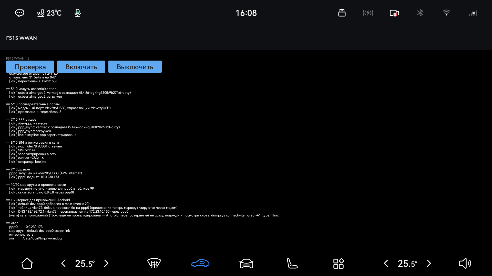

# F515 — WWAN через Huawei-модем (мобильный интернет из USB-модема)

Подключаешь Huawei-модем (семейство E17x/E1750/E3272, `12d1:*`) в USB головы F515 —
приложение поднимает его как мобильный интернет для головы и для остальных приложений
Android. Одна кнопка, без пересборки boot/vendor_boot.

## Установка

1. Скачай `app/F515WwanApp.apk` из этого репозитория.
2. Установи на голову — через USB-флешку и штатный установщик Toolbox (`pm install` на
   этой прошивке отключён политикой), либо через EngMode-инъекцию. Подробнее —
   [app/README.md](app/README.md).
3. Вставь модем в USB, открой приложение, нажми **Включить**.

Готово — модем поднят по PPP, интернет виден и приложениям Android.

## Кнопки

- **Проверка** — диагностика, ничего не меняет
- **Включить** — поднять модем/PPP и раздать интернет приложениям Android
- **Выключить** — остановить pppd
- **Интернетометр** — открыть проверку скорости в браузере

## Структура репозитория

| Путь | Что |
|---|---|
| `scripts/` | `wwan-up.sh` (главный скрипт) + `dial.sh`/`at.sh` + пример конфига |
| `modules/` | исходники `usbserialmerged2`/`ppp_async`, готовые `.ko`, скрипт пересборки |
| `tools/` | `huawei-modeswitch` — modeswitch без Frida/usb_modeswitch, исходник + сборка |
| `app/` | Android-приложение (кнопки над теми же скриптами), исходники + готовый APK |
| `docs/manual.md` | ручной запуск по чистому ADB (без приложения) + как всё устроено внутри |

## Подробнее

- Ручной запуск по ADB, без приложения; как устроены стадии `wwan-up.sh`; ограничения —
  [docs/manual.md](docs/manual.md)
- Почему и как трафик приложений Android заворачивается через модем —
  [docs/app-network.md](docs/app-network.md)

## Поддержка

[Поблагодарить](https://pay.cloudtips.ru/p/aa2fce54)

Создано [@dsultanr](https://github.com/dsultanr)
